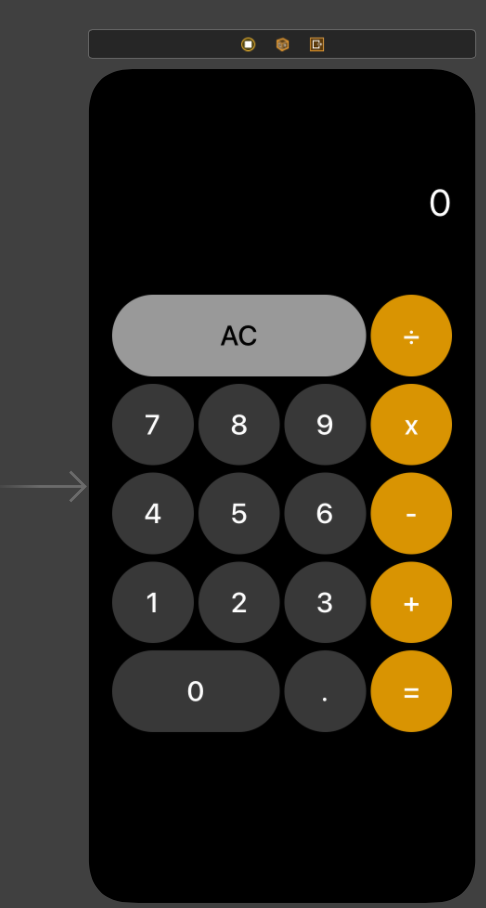
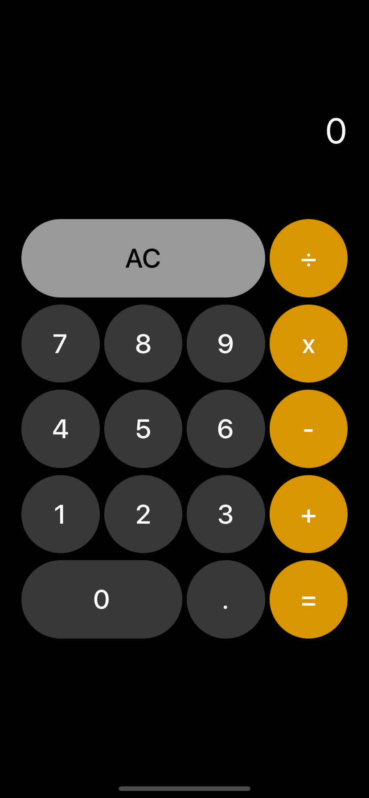
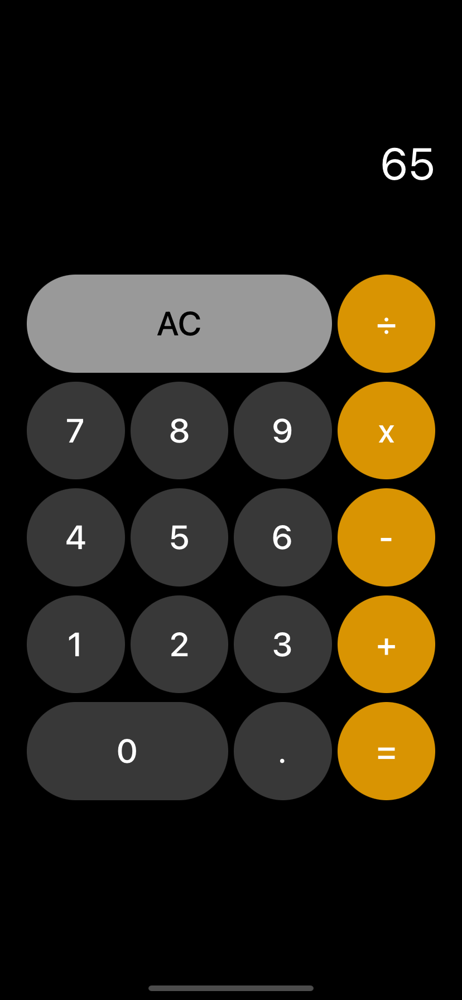
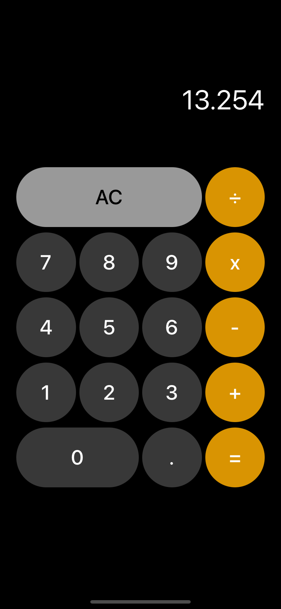

# Calculator 1(계산기)

## 사용한 기술

* Swift 5, Xcode 12.5.1
* UIStackView, IBDesignables, IBInspectable

## 수행 역할

* UIStackView로 여러개의 view를 한 셋트로 만들어 표현
* IBDesignables, IBInspectable를 이용해 스토리보드에서 속성값 수정

## 스토리보드

## 스크린샷

