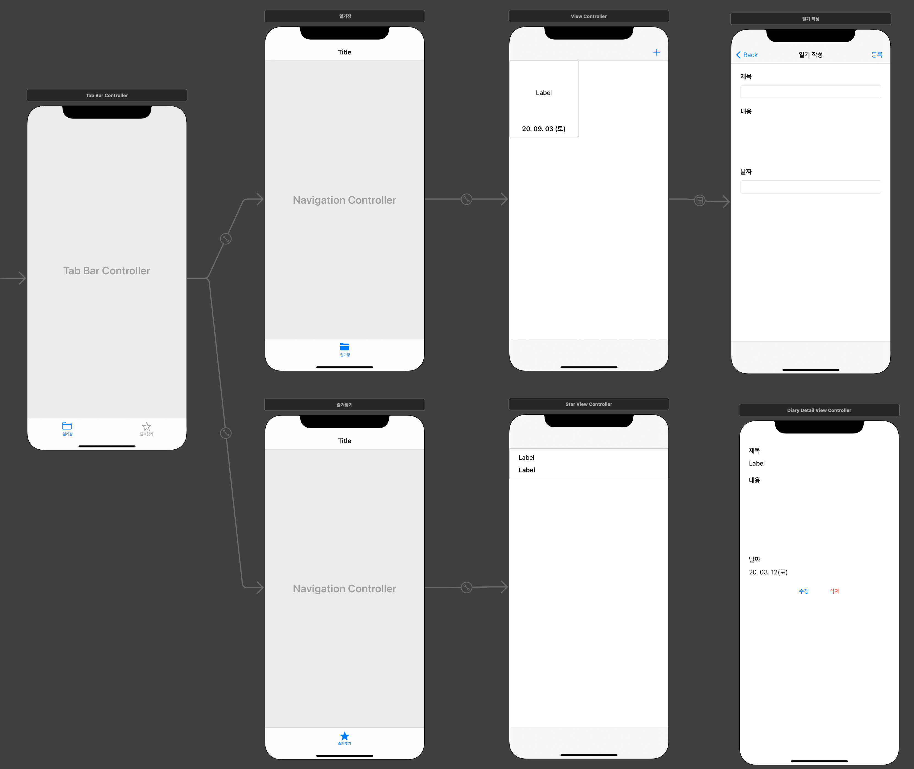
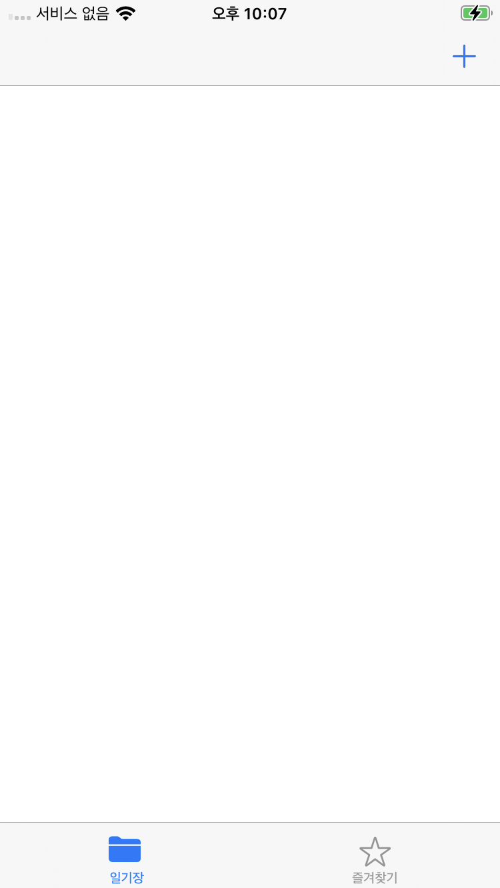
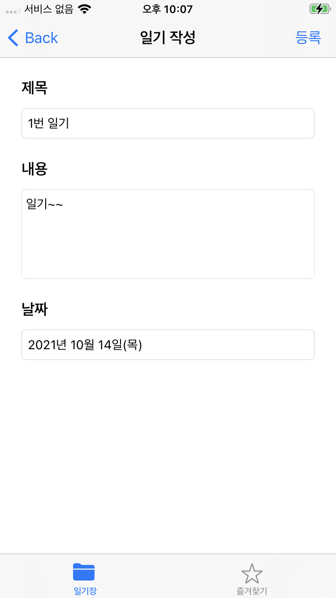
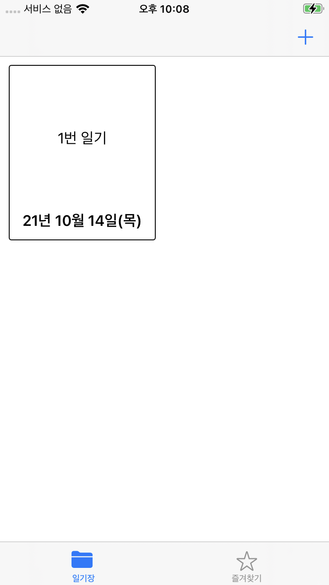
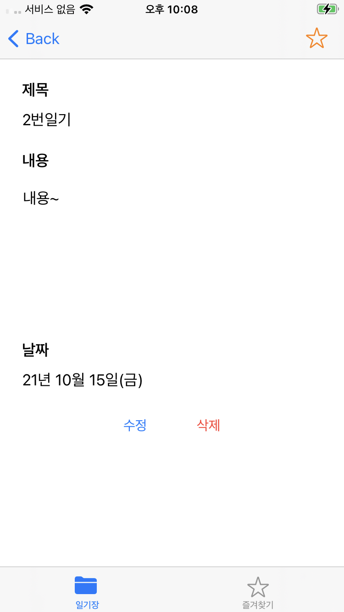
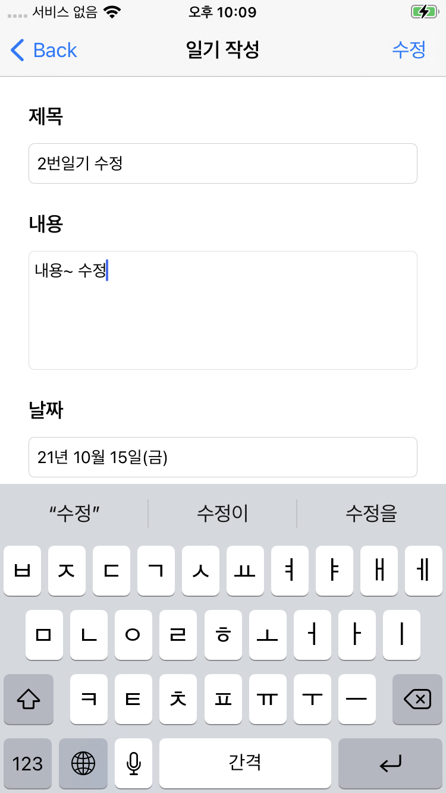
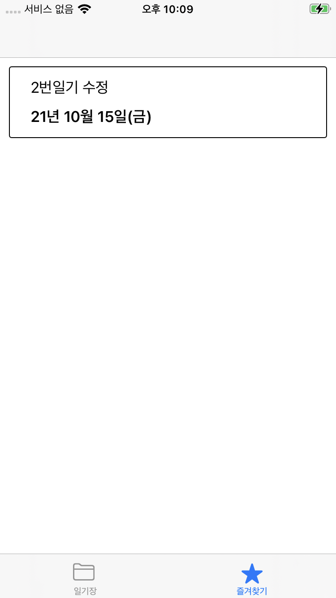
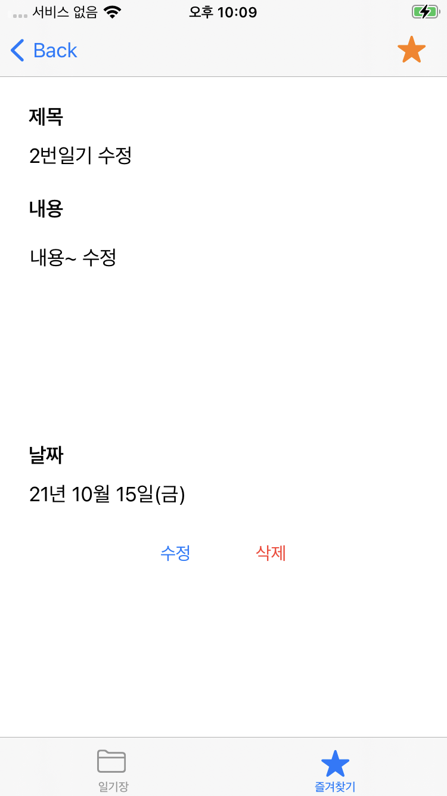

# Diary

## 사용한 기술

* Swift 5, Xcode 12.5.1
* UICollectionView, UITabBarController, NotificationCenter

## 수행 역할

* UICollectionView를 이용해 일기 목록 정리
* UITabBarController를 이용해 일반 탭과 즐겨찾기 탭 분리
* NotificationCenter를 이용해 내용 변경

## 스토리보드

## 스크린샷

