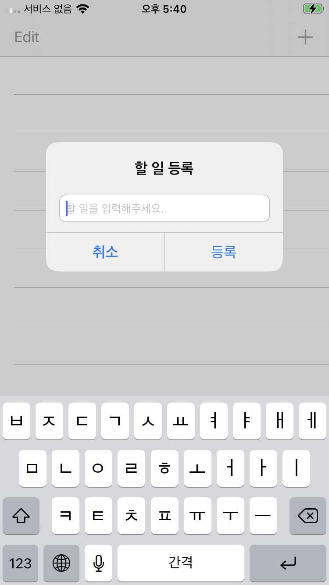

# TodoList

## 사용한 기술

* Swift 5, Xcode 12.5.1
* UITableView

## 수행 역할

* TableView를 이용해 todoList구현

## 스크린샷




## UITableViewDataSource

```swift
    //각 세션에 표시할 행의 개수를 묻는 메서드
    func tableView(_ tableView: UITableView, numberOfRowsInSection section: Int) -> Int {
        <#code#>
    }
    
    // 특정 인덱스 row의 cell에 대한 정보를 넣어 cell을 반환하는 메서드
    func tableView(_ tableView: UITableView, cellForRowAt indexPath: IndexPath) -> UITableViewCell {
        <#code#>
    }
    
    // 총 섹션 개수를 묻는 메서드
    func numberOfSections(in tableView: UITableView) -> Int {
        <#code#>
    }
    
    // 특정 섹션의 헤더 타이틀을 묻는 메서드
    func tableView(_ tableView: UITableView, titleForHeaderInSection section: Int) -> String? {
        <#code#>
    }
    
    // 특정 섹션의 풋터 타이틀을 묻는 메서드
    func tableView(_ tableView: UITableView, titleForFooterInSection section: Int) -> String? {
        <#code#>
    }
    
    // 특정 위치의 행이 편집 가능한지 묻는 메서드
    func tableView(_ tableView: UITableView, canEditRowAt indexPath: IndexPath) -> Bool {
        <#code#>
    }
    
    // 특정 위치의 행을 재정렬 할 수 있는지 묻는 메서드
    func tableView(_ tableView: UITableView, canMoveRowAt indexPath: IndexPath) -> Bool {
        <#code#>
    }
    
    // 테이블 뷰 섹션 인덱스 타이틀을 묻는 메서드
    func sectionIndexTitles(for tableView: UITableView) -> [String]? {
        <#code#>
    }
    
    // 인덱스에 해당하는 섹션을 알려주는 메서드
    func tableView(_ tableView: UITableView, sectionForSectionIndexTitle title: String, at index: Int) -> Int {
        <#code#>
    }
    
    //스와이프 모드, 편집 모드에서 버튼을 선택하면 호출되는 메서드
    // 해당 메서드에서는 행에 변경사항을 Commit 해야 함
    func tableView(_ tableView: UITableView, commit editingStyle: UITableViewCell.EditingStyle, forRowAt indexPath: IndexPath) {
        <#code#>
    }
    
    // 행이 다른 위치로 이동되면 어디에서 어디로 이동하는지 알려주는 메서드
    func tableView(_ tableView: UITableView, moveRowAt sourceIndexPath: IndexPath, to destinationIndexPath: IndexPath) {
        <#code#>
    }
```

## UITableViewDelegate

```swift
    //행이 선택되었을 때 호출되는 메서드
    func tableView(_ tableView: UITableView, didSelectRowAt indexPath: IndexPath) {
        <#code#>
    }
    
    //행이 선택 해제되었을 때 호출되는 메서드
    func tableView(_ tableView: UITableView, didDeselectRowAt indexPath: IndexPath) {
        <#code#>
    }
    
    //특정 위치 행의 높이를 묻는 메서드
    func tableView(_ tableView: UITableView, heightForRowAt indexPath: IndexPath) -> CGFloat {
        <#code#>
    }
    
    //지정된 섹션의 헤더 뷰 에 표시할 View가 어떤 건지 묻는 메서드
    func tableView(_ tableView: UITableView, viewForHeaderInSection section: Int) -> UIView? {
        <#code#>
    }
    
    //지정된 섹션의 풋터 뷰 에 표시할 View가 어떤 건지 묻는 메서드
    func tableView(_ tableView: UITableView, viewForFooterInSection section: Int) -> UIView? {
        <#code#>
    }
    
    //지정된 섹션의 헤더 뷰 높이를 묻는 메서드
    func tableView(_ tableView: UITableView, heightForHeaderInSection section: Int) -> CGFloat {
        <#code#>
    }
    
    //지정된 섹션의 풋터 뷰 높이를 묻는 메서드
    func tableView(_ tableView: UITableView, heightForFooterInSection section: Int) -> CGFloat {
        <#code#>
    }
    
    //테이블 뷰가 편집 모드에 들어갔을 때 호출되는 메서드
    func tableView(_ tableView: UITableView, willBeginEditingRowAt indexPath: IndexPath) {
        <#code#>
    }
    
    //테이블 뷰가 편집모드에서 빠져나왔을때 호출되는 메서드
    func tableView(_ tableView: UITableView, didEndEditingRowAt indexPath: IndexPath?) {
        <#code#>
    }
    
    //테이블 뷰가 셀을 사용하여 행을 그리기 직전에 호출되는 메서드
    func tableView(_ tableView: UITableView, willDisplay cell: UITableViewCell, forRowAt indexPath: IndexPath) {
        <#code#>
    }
    
    //테이블 뷰로부터 셀이 화면에 사라지면 호출되는 메서드
    func tableView(_ tableView: UITableView, didEndDisplaying cell: UITableViewCell, forRowAt indexPath: IndexPath) {
        <#code#>
    }
```

